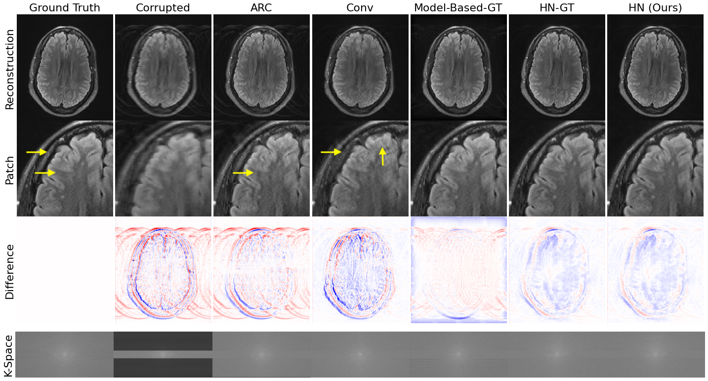

# neuroMoCo
Data-consistent deep rigid motion correction for brain MRI

## Dependencies
All dependencies required to run this code are specified in `environment.yml`. To create an anaconda environment with those dependencies installed, run `conda env create --name <env> --file environment.yml`. 

You will also need to add this repo and [interlacer](https://wwww.github.com/nalinimsingh/interlacer) to your python path (if you're using conda, `conda-develop /path/to/neuroMoCo/`).

## Method Overview
There are three codestreams involved in our method:

1. [Simulation](#motion-simulation) of motion-corrupted examples
2. [Training](#model-training) a model using the simulated data
3. [Optimizing](#test-time-optimization) the motion parameter estimates.

## Motion Simulation
Unfortunately, we are unable to share our data and full data processing pipeline due to IRB restrictions. However, `motion_sim/multicoil_motion_simulator.py` contains a sample training generator which should give you an idea of how to write your own generator. Running this file will generate a folder containing .npz files used at training and test time. 

## Model Training
The entry script to our model training is in `training/train.py`, which creates a model (defined in `training/models.py` and `training/hypermodels.py`) and trains the hypernetwork appropriately. `training/run_experiment.py` provides an example script to run training on a SLURM setup.

## Test-Time Optimization
The test-time optimization code is found in `optimization/optimize_motion_params.py`, which can be run as a script to perform optimization on all the examples in a directory. Alternatively, `optimize_example()` can be called to run optimization on a single example. 

## Paper
If you use the ideas or implementation in this repository, please cite our [paper](https://arxiv.org/abs/2301.10365):

    @misc{singh2023data,
        title={Data Consistent Deep Rigid MRI Motion Correction},
        author={Nalini M. Singh and Neel Dey and Malte Hoffmann and Bruce Fischl and Elfar Adalsteinsson and Robert Frost and Adrian V. Dalca and Polina Golland},
        year={2023},
        eprint={2301.10365},
        archivePrefix={arXiv},
        primaryClass={eess.IV}
    }     

